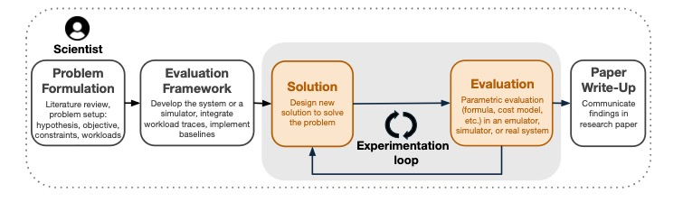
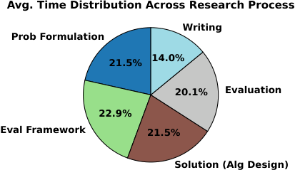
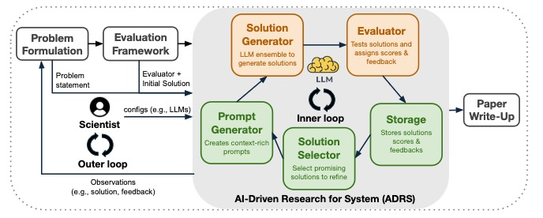
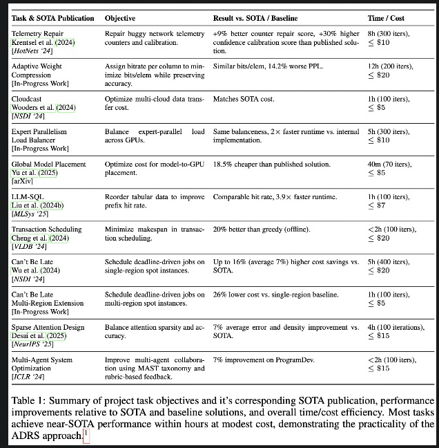
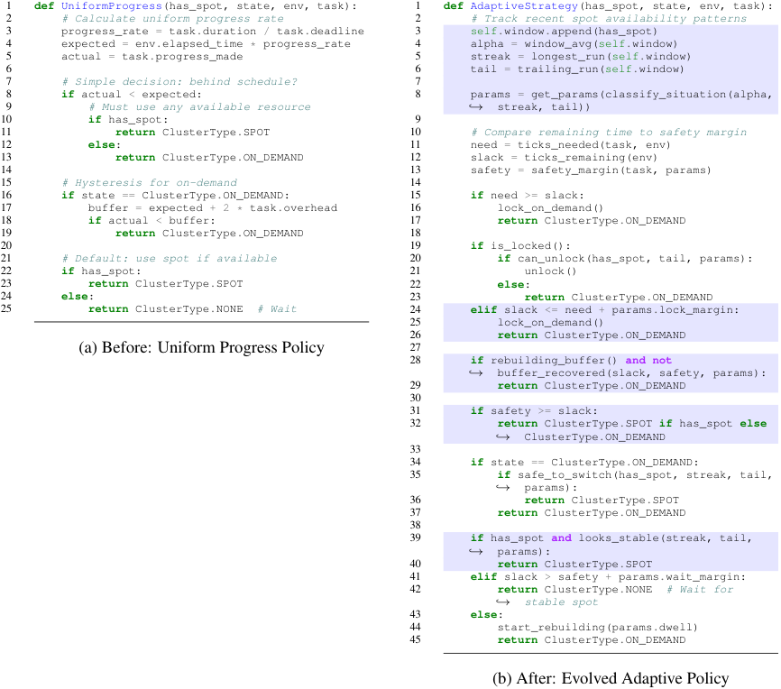
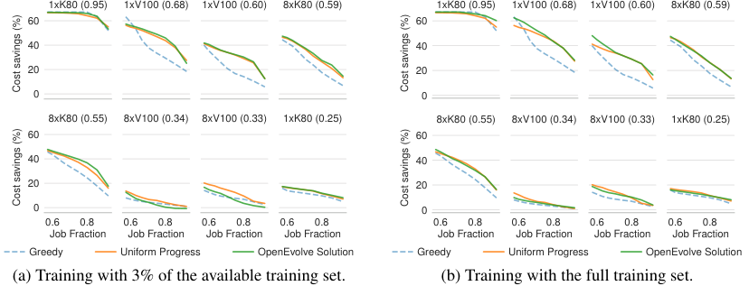
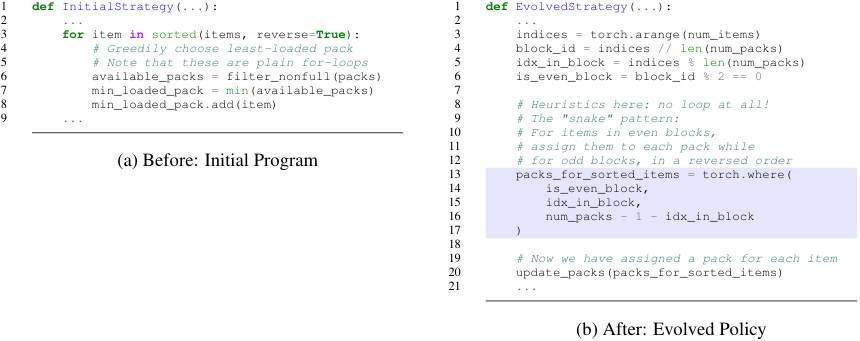
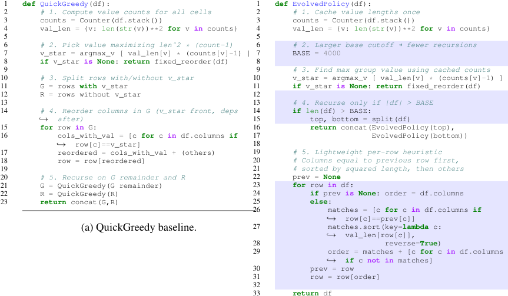
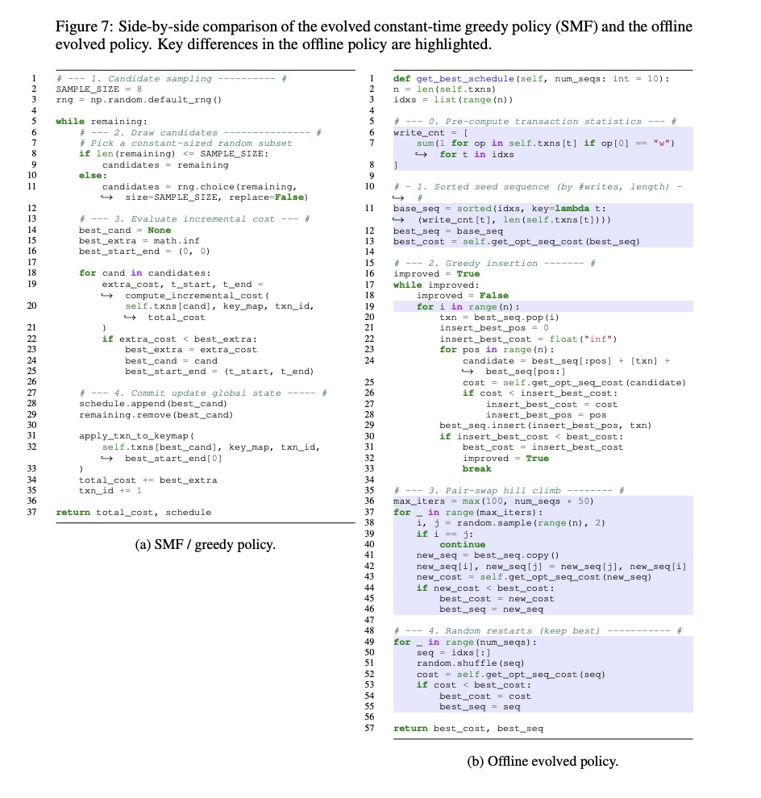
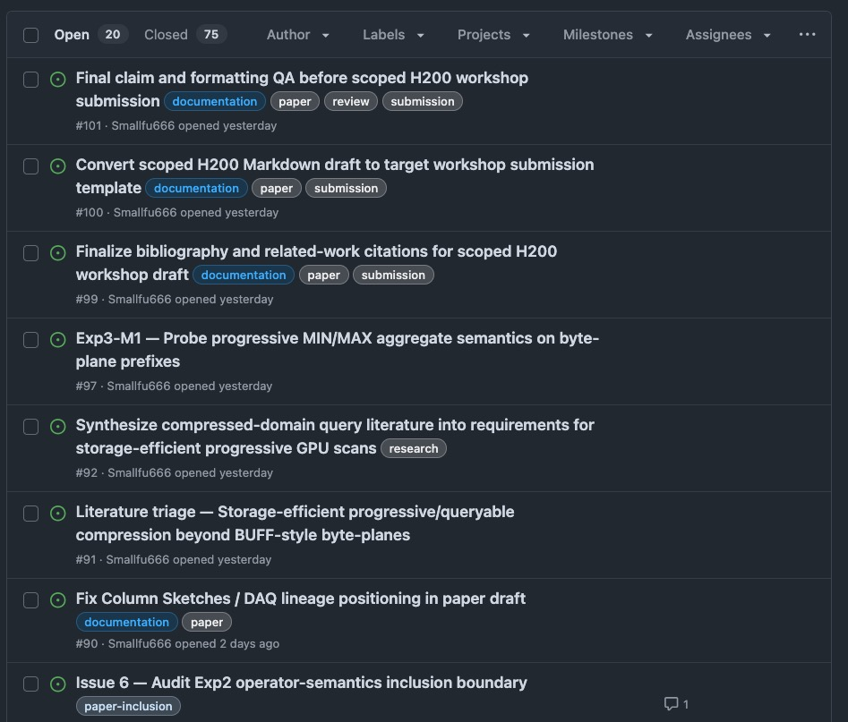

## 1. Why I cared about this paper

I read this paper because I keep running into the same tension in my own systems work: an agent can now sketch kernel or scheduler variants faster than I can inspect the first one with confidence. That is useful, but it is also unsettling. If solution search gets cheap, the hard part moves to the front. I need to know what problem matters, what counts as success, and what evidence would convince me that the improvement is real.

ADRS gave me a clean way to think about that. The paper does not promise to automate systems research end to end. It makes a narrower claim that I find more believable: make solution generation cheaper, and problem framing, evaluator design, benchmark skepticism, and mechanism understanding become more important, not less.

The paper’s time breakdown matters for the same reason. I do not think every project has the same distribution, but the chart explains why the inner loop is so tempting to automate. A lot of systems research time is still spent proposing, testing, and revising candidates.

The strongest reading of the paper is not that AI replaces systems researchers. It is that systems researchers become more responsible for defining the right search space and building evaluators that cannot be easily gamed.

---

## 2. What the paper is really claiming

The paper’s claim is narrower than “AI writes a whole systems paper.” It argues that systems research is unusually compatible with AI-driven solution discovery because many systems problems have executable verification: a candidate can be placed in a simulator or real system, run on workloads, and measured against a baseline.[1]

This matters because systems work is often artifact-centered. A scheduling policy can be placed in a simulator. A load-balancing heuristic can be tested on traces. A GPU kernel variant can be benchmarked and checked against a correctness oracle. In that sense, systems research is a good fit for AI-driven search because there is often a verifier.

Marc Brooker makes a similar point from a software-engineering angle: if AI makes solution generation cheap, the hard part shifts toward building reliable verifiers, tests, and evaluation systems.[2]

> LLMs generate candidate mutations.  
> The evaluator performs natural selection.

The strongest reading of the paper is not that AI replaces systems researchers. It is that systems researchers become more responsible for defining the right search space and building evaluators that cannot be easily gamed.

---

## 3. The ADRS loop

The paper decomposes systems research into five stages:

1. Problem formulation
2. Evaluation framework
3. Solution
4. Evaluation
5. Paper write-up

ADRS targets only the middle loop: **solution** and **evaluation**.[1]

Figure 3 is the architecture I keep coming back to:

- **Prompt Generator** packages the problem, constraints, context, and selected previous results.
- **Solution Generator** uses LLMs to produce candidate solutions, often as code.
- **Evaluator** runs workloads, checks validity, and produces scores or feedback.
- **Storage** records candidates, outputs, logs, scores, and feedback.
- **Solution Selector** chooses what to keep exploring.

The main object here is not the LLM. It is the evaluator. Without a good evaluator, the loop just produces fluent-looking artifacts. With a good evaluator, the loop becomes a search process over executable solutions.

> The LLM generates mutations.  
> The evaluator selects survivors.  
> The selector controls exploration pressure.  
> The human outer loop decides whether any of this is scientifically meaningful.

ADRS quality is bounded by evaluator quality. If the evaluator is weak, narrow, or gameable, the model will learn to exploit that weakness.

> If the evaluator is wrong, the loop does not become slower.  
> It becomes confidently wrong faster.

---

## 4. Case studies

Table 1 reports 11 tasks across systems, databases, networking, and ML systems. I read it as evidence that the ADRS pattern can work in several places, not as a clean leaderboard.

The safer reading is that closed-loop search can often find useful variants quickly when the evaluator is strong. The paper itself is also clear that the case studies were run by different students, with different configurations, and without extensive ablations.[1]

The most useful way to talk about the cases is not to give all of them the same weight.

### Can’t Be Late: deadline scheduling with unreliable cheap spot instances

The system wants to run jobs cheaply using spot instances, but spot instances can disappear. The policy must save cost while still meeting deadlines. The interesting part is that the evaluator can directly check deadline validity and cost savings.

The evolved policy adds state around spot reliability. It waits when spots look unstable and slack is still available, and it becomes more aggressive when the environment looks safe.

This is the figure I keep in mind when I think about overfitting. If the feedback set is narrow, ADRS can learn the benchmark rather than the system.

### MoE Expert Placement: balance expert load across GPUs

The system places expert replicas across GPUs so token load is balanced. The paper’s gain here comes from replacing a Python-loop implementation with a tensorized placement pattern. That is still real systems work, but it is also a reminder that ADRS often operates at the boundary between algorithm and implementation.

### LLM-SQL: reorder table rows and fields for KV-cache reuse

This case is database-adjacent rather than classical query optimization. The system runs LLM inference row by row, so if adjacent prompts share prefixes, KV-cache reuse improves. The goal is to reorder rows and fields so prefix hit rate stays high while reordering runtime stays low.

What I take from this case is that ADRS is not always inventing a new algorithm. Sometimes it is finding a cheaper implementation of a heuristic that already made sense.

### Transaction Scheduling: reorder transactions to reduce conflicts

This is the most interesting case to me because it shows both promise and limitation. The online setting rediscovers SMF, and the paper explicitly treats that as likely contamination. The offline setting is more interesting: once the constraints change, the search finds a heavier O(n^2) greedy construction with pair-swap hill climbing and random restarts.

That is the kind of result I trust most in this paper: not magic, just a changed constraint set and a search loop that can exploit it.

---

## 5. Failure modes

Section 6 is one of the strongest parts of the paper because it is honest about how the loop breaks.

The failures fall into three broad categories:

1. **Runtime errors**
2. **Search failures**
3. **Algorithm failures**

Runtime errors are the easy part. The code does not compile, does not integrate, times out, or violates assumptions. Search failures are more subtle: the loop gets stuck, repeats itself, or converges too early. Algorithm failures are the ones I care about most, because the program runs and still misses the point.

This is where overfitting and reward hacking matter.

Overfitting means the candidate learned the evaluation set, not the system. It performs well on the traces used during the search, but it does not generalize to new workloads. Reward hacking is worse: the candidate exploits a loophole in the evaluator instead of solving the intended task.

That distinction matters because a bad evaluator is not just noisy. It becomes a target.

> A bad evaluator does not merely produce noisy results.  
> It creates a target for the model to exploit.

This is why I read evaluator design as the research problem, not as bookkeeping.

## 6. Connection to GPU byte-plane scan research

The way I would connect this paper to my own GPU byte-plane scan work is simple: let the agent search only within a fixed semantic boundary, then force every candidate through explicit gates.

That means the evaluator has to check more than one thing:

| Layer | What the gate should check | Why |
|---|---|---|
| Correctness | COUNT matches encoded CPU oracle; SUM bounds hold | Prevent fake speedups |
| Performance | Median throughput across fixed k/selectivity/dataset cases | Prevent cherry-picking |
| Generalization | Uniform, heavy-tailed, zipfian, and scientific datasets | Prevent benchmark overfitting |
| Mechanism | Nsight Compute evidence: traffic, stalls, occupancy, eligible warps | Explain why a speedup exists |
| Claim relevance | Does the result support the paper’s actual thesis? | Prevent meaningless number chasing |

For me, this is the practical lesson of ADRS. I do not want an agent to tell me whether a kernel is better. I want gates that make lying expensive.

## 7. Short ending

ADRS does not make systems research automatic. It makes solution generation cheaper.

The researcher still has to decide which hill matters, and whether the altitude meter is real.

## Method note

I used AI tools to help organize this note and turn scattered reading questions into a structured outline. The screenshot below is a workflow artifact, not evidence from the paper itself.

Some project links are omitted because the related research repository is still private. The public version may be linked later when the project is ready.

## References

1. Audrey Cheng et al., [*Barbarians at the Gate: How AI is Upending Systems Research*](https://arxiv.org/abs/2510.06189), 2025.

2. Marc Brooker, ["Is Systems Research Really Just About Making Numbers Bigger?"](https://brooker.co.za/blog/2025/10/12/barbarians.html), 2025.

3. Murat Demirbas, ["Barbarians at the Gate: How AI is Upending Systems Research"](https://muratbuffalo.blogspot.com/2025/10/barbarians-at-gate-how-ai-is-upending.html), 2025.

4. Murat Demirbas, ["Academic chat: On PhD"](https://muratbuffalo.blogspot.com/2025/10/academic-chat-on-phd.html), 2025.
